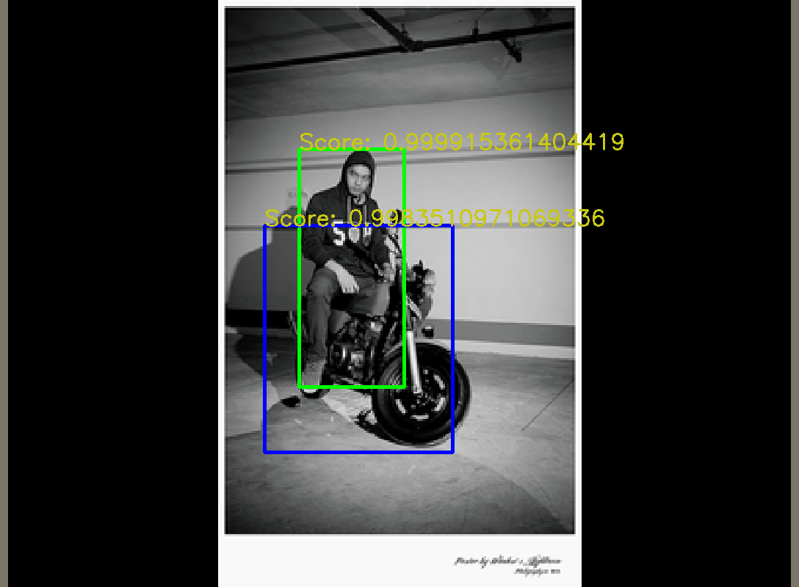
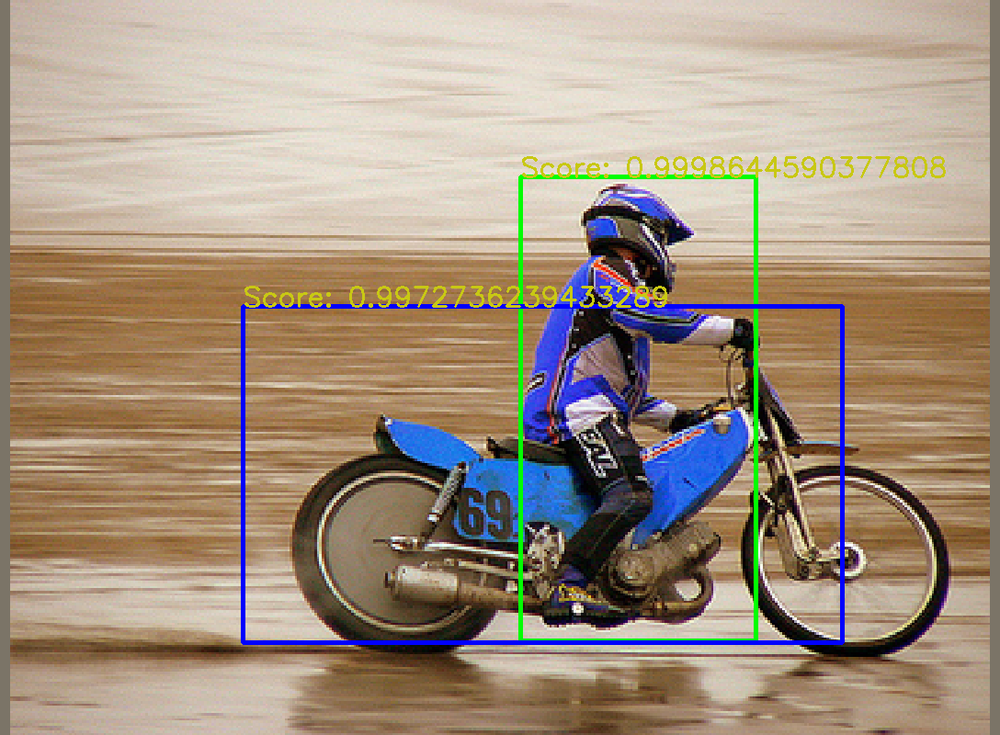
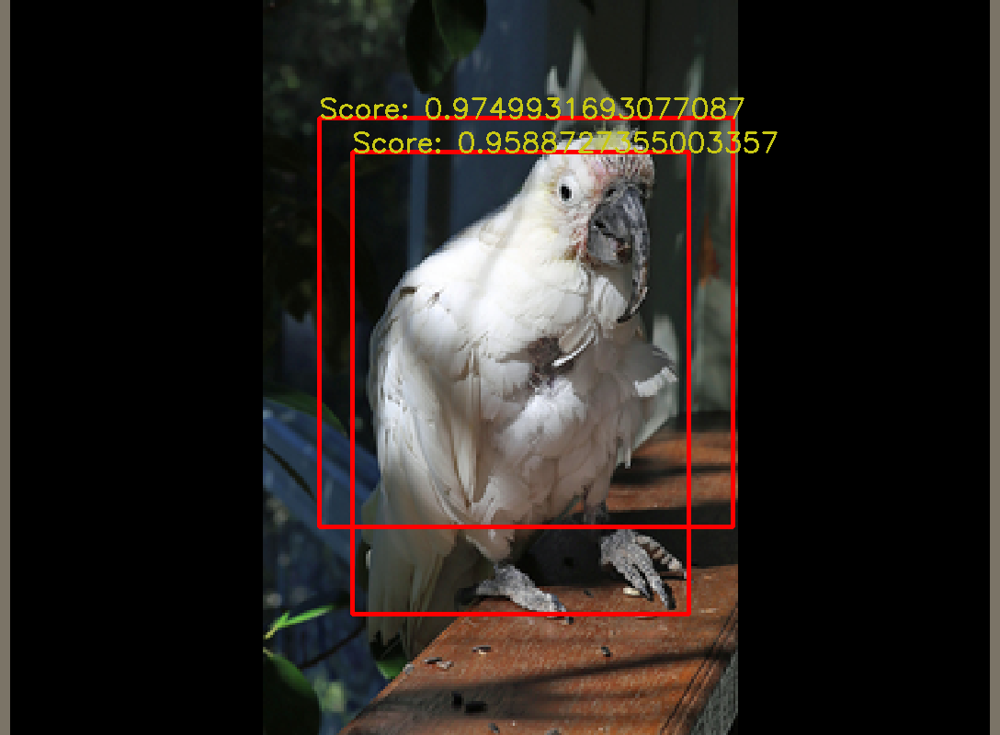
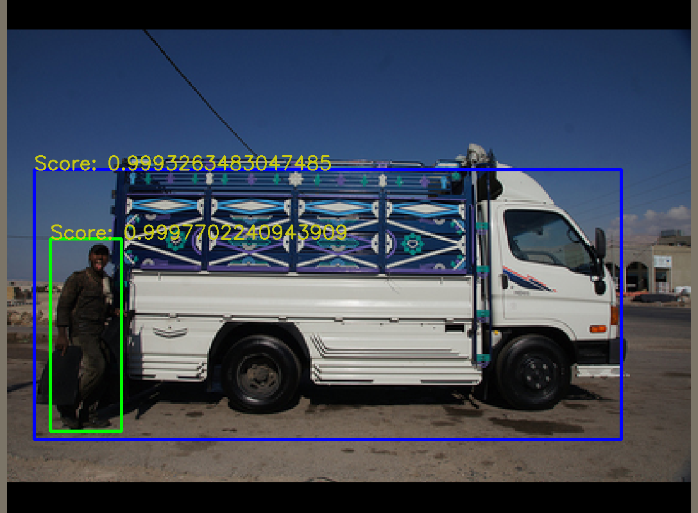
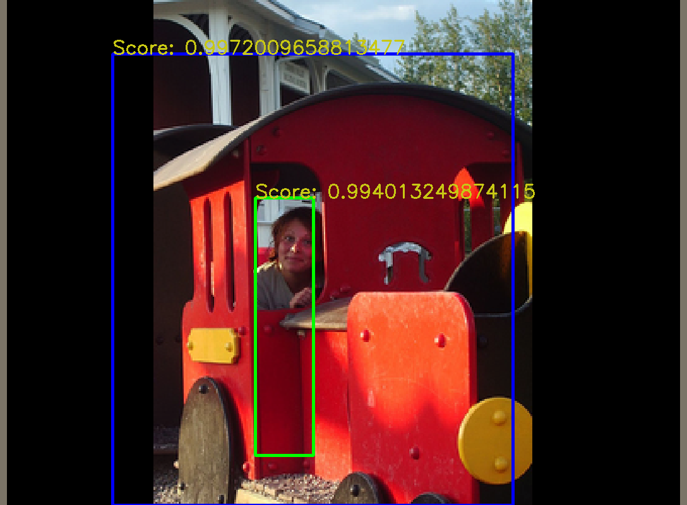

# faster-rcnn-toy
Simple implementation of Faster-RCNN

*CIS 680: Advanced Topics in Machine Perception FA2020, University of Pennsylvania.*

**Authors:** Zhihao Ruan ruanzh@seas.upenn.edu, Kun Huang huangkun@seas.upenn.edu

## Introduction
Faster-RCNN is a deep neural network targeting real-time object detection. It consists of a backbone made up with an FPN (Feature Pyramid Network) and an RPN (Region Proposal Network). The outputs coming from RPN are fed into a Box Head, which is an object detection head consisting of a classification branch and a regression branch, and each of them are set up with a set of fully connected layers. This repo implements a simplified version of Faster-RCNN, which uses a pre-trained FPN and RPN as backbone, and implements the Box Head. For infos about Faster-RCNN, please refer to the [official code](https://github.com/ShaoqingRen/faster_rcnn).

## Object Detection Demos
On a simplified COCO dataset, we reached a 0.5265.







## Usage
As a course project, we used a simplified COCO dataset provided from Prof. Jianbo Shi of University of Pennsylvania, which as attached in `data/` and dataset building methods can be found in `src/dataset.py`. All of the Box Head architecture are defined in `src/BoxHead.py`. To run the training pipeline, please run the following commands:
```bash
cd ${PROJECT_ROOT}
python src/main_train.py
```

To run the validation pipeline, please run
```bash
cd ${PROJECT_ROOT}
python src/main_infer.py
```

## Configurations
We used Anaconda virtual environment as the official development environment. All the Conda packages used can be found in `environment.yml`.

## References
```bibtex
@misc{ren2016faster,
      title={Faster R-CNN: Towards Real-Time Object Detection with Region Proposal Networks}, 
      author={Shaoqing Ren and Kaiming He and Ross Girshick and Jian Sun},
      year={2016},
      eprint={1506.01497},
      archivePrefix={arXiv},
      primaryClass={cs.CV}
}
```
